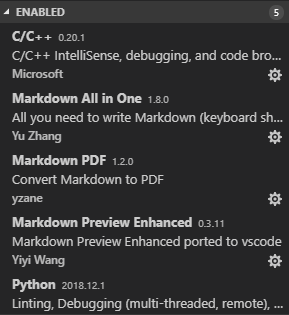
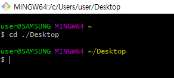
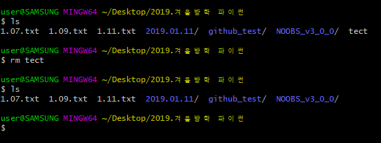
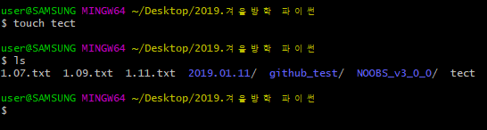
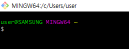
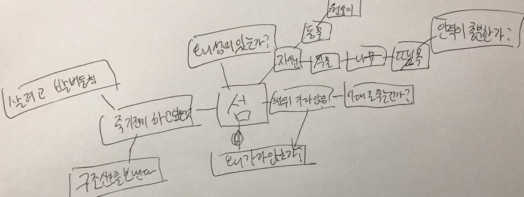
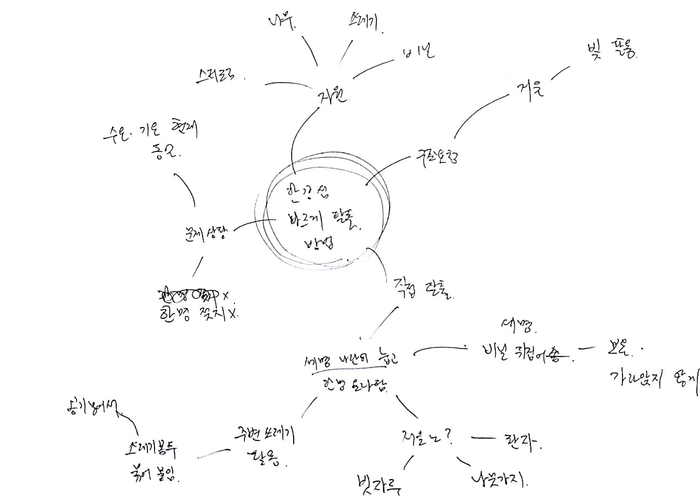

# 복습노트

 1일차
1. 파이썬 기초 문법
 
 2일차
   1. 리눅스 기본 명령어
 
 3일차
   1. Visual Studio Code 설정 및 사용법
   2. 리눅스 기초 문법
   3. git hub와 git base 사용법
 
 4일차
   1. 이전 시간 질문
   2. base, git, python, markdown 문법 정리
   3. python 예제풀이
   4. python을 이용한 그래프 그리기
 
 5일차
 
 6일차
 
 7일차
 
 8일차
 
 9일차
 
 10일차


## Day01
- 일시 : 2019.01.07 월요일 15:00~18:00
- 장소 : 건국대학교 새천년관 1203호
- 작성자 : 유재덕

강의 목표
	1. 파이썬 기초 문법

### 1. 파이썬 기초 문법
- 이름 짓는 방법
1. camelCase-iAmATopSinger : 대문자가 공백 역할을 한다고 보면 된다.
2. snakeCase-i_am_a_top_singer : 언더바가 공백 역할을 한다고 보면 된다.

	- 모듈-소문자
	- class-camel
	- 함수-snake
	- 들여쓰기는 스페이스 4번

- 기초 문법
특이한 것들
a/b 	> float 형 결과
a//b 	> int 형 결과
a**b	> a의 b 제곱

- 문자열
  - python에서 문자열은 배열과 비슷하다.
	str Hello World-> str[0]='H', str[1]='e'...
	Hello->str[0:5]
	```python
	str[a:b:c]
	```
	a-시작점
	b-끝점
	c-c=2일때, 한단계씩 건너뛰면서 출력
	
	ex) 
	```python
	str Hello World
	str[0:4:2]
	```
 	결과 : fl

  - str[-a]->뒤에서 두번째(overflow, underflow 개념이라 보면 됨)

- for문의 형태
	for 문의 방식이 상당히 많다.
	```python
	1. 	test=[1,2,3,4,5]
		for i in test:

	2.	for i in [1,2,3,4,5]:

	3.	for i in range(0,5):

	4.	for i in range(5):
	```

## Day02
- 일시 : 2019.01.09 수요일 15:00~18:00
- 장소 : 건국대학교 새천년관 1203호
- 작성자 : 유재덕


 강의 목표
     1. 리눅스 기본 명령어 숙지
     2. 기초 실습

### 1. 리눅스 기본 명령어
- sudo->관리자 권한으로 실행
- ls > 현재 폴더 내의 파일들(폴더&파일)
- ls -al > 권한 포함 모든 정보 보여줌
- . > 현재 경로
- .. > 상위 폴더
- pwd > root에서 현재경로 표시해줌
- / > 폴더 내부로 들어갈때
- mv a b > a를 b로 이동시킴
- mkdir > make a directory
- cd > change directory
- nano (file name).py > 파일 내용 편집(없으면 생성)
- python(3) (filename).py > python으로 해당 파일 실행
- (명령어) --help > 해당 명령어에 대한 정보 제공

## Day03
- 일시 : 2019.01.11 
- 금요일 15:00~18:00
- 장소 : 건국대학교 새천년관 1203호
- 작성자 : 유재덕

강의 목표
	1. Visual Studio Code 설정 및 사용법
	2. git hub와 git base 사용법

### 1. Visual Studio Code 설정 및 사용법
- 기초 설정
 
  - Explorer-컴퓨터 내의 md파일 불러오기 가능. 편집할때 주로 사용.
  - Extensions-추가 기능 설치할때 검색해서 사용. 
  - 현재 설치한 목록
 
    - C/C++, Python : 특정 부분을 해당 코딩 언어 양식과 유사하게 만들어줌
    - Markdown All in One : Markdown 활용할때 필요함
    - Markdown PDF : 특정 파일을 PDF로 변환
    - Markdown Previev Enhanced : 미리보기 기능
  - 만약 한글이 꺠져보인다면, Ctrl+Shift+P로 'Change File Encodeing' 검색. 'Reopen with encoding'에서 'Korean' 선택
- 이미지 집어넣기
\![name]\(그림 위치\)

- 링크 집어넣기
[name] (링크)
[네이버](http://www.naver.com)

- 각 코딩 언어에 어울리는 형태로 나타내기
	\`\`\`(언어 이름)\`\`\`
	-Extensions에서 미리 언어에 관련된 것들을 설치해둬야됨.
```python
import math
print("hello world")
```
```c
#incude <stdio.h>
int main(void){
	int a,b,c=1;
	a=b+c
}
```
- 표 나타내기
	|a|b|c|
	
	|-|-|-|
	
	|e|f|g|

	| 순번 | 이름 | 학과 |
	|-|-|-|
	| 1| 유재덕 |전자공학과|

	기타 궁금한 문법은 [해당 링크](https://gist.github.com/ihoneymon/652be052a0727ad59601)로 들어가서 알아볼 것

### 2. Git Hub/Git Bush 기본 사용법

    1. git bush 기본 설정
    2. Git Hub 서버에서 프로젝트 가져오기
    3. Git Hub 서버에 편집한 프로젝트 올리기

1. git bush 기본 설정
git config
git config email "(이메일)"
git config name "(name)"

- 사용자의 이메일과 이름을 정해줌

2. Git Hub 서버에서 프로젝트 가져오기
git clone "(address)"
- 주소는 해당 프로젝트 페이지의 주소

3. Git Hub 서버에 편집한 프로젝트 올리기
git add .
git commit -m "(message)"
git push
- git add . 에서 현재 위치는 master 상태, 즉 불러온 파일이여야 한다. . 은 현재 위치에서 모든 하위폴더를 포함한 것을 의미함.
- message 부분에는 어떤 부분을 바꿨는지 설명해주도록 하자. 


## Day04
- 일시 : 2019.01.14 월요일 15:00~18:00
- 장소 : 건국대학교 새천년관 1203호
- 작성자 : 유재덕

강의 목표
	1. 이전 시간 질문
	2. bash
	3. python 자료형
   
### 1. 이전시간 질문
	'#' : 모든 작업 실행 가능
	'$' : 일정 부분 실행 불가능

### 2. bash
- OS : Windows vs UNIX base OS
		- Windows : Microsoft
		-UNIX based OS : Linux(Android, Mac OS, iOS)
		
	- GUI(Graphic User Interface) vs CUI(Character User Interface)

		- GUI
			- 그래픽 기반의 인터페이스
			- 현재 대부분 이 시스템을 사용
			- Windows OS가 여기에 해당
		- CUI
			- 텍스트 기반, 즉 PC 초기의 인터페이스
			- 키보드가 표준 입력 도구. 마우스 제외하고도 모든 기능 사용 가능
			- 주로 프로그래밍에 사용
			- UNIX 기반(Android, Linux, mac OS, iOS) OS가 주로 여기에 해당

- Bash : 쉽게 말해서 만능 탐색기 겸 작업 인터페이스. Linux에서 주로 사용한다.
    1. 명령어
		- cd : change directory 약자
		- cd ./(a)/(b)/ : 현재 위치의 (a)폴더 안의 (b)폴더로 change directory
			
		- ls : 현재 directory 내의 파일들을 보여줌
			
		- rm : remove 약자
			
		- mkdir : directory 생성
		- pwd : 현재 경로의 위치
		- mv : 파일 이동. move a file to b directory 
		- git : git base 전용 명령어
		- touch \<file name\> : 내용이 없는 파일을 생성
			
		- nano \<file name\> : 내용이 있는 파일을 생성

  	2. 기호
       - . : 현재 경로부터 최하위 경로까지 모든 파일들
       - .. : 상위 폴더
       - ~ : C/User/user의 줄임말.
	
       - / : 붙은건 폴더, 안붙은 파일

### 3. 
자료형 
1. 숫자 자료형-모든 숫자가 여기에 해당.
```python
n = 3.123456789
```
2. 문자열 자료형
```python
str = 'Hello World!'
str = "Hello World!"
str = "I'm a boy"
str = 'I\'m a boy' #작은 따옴표 표현할땐 큰 따옴표, 혹은 역슬래쉬 사용
```
3. 리스트 자료형
```python
arr=[1,2,3,4,5]
arr2=['h', 'e', 'l', 'l', 'o']
```
4. 튜플 자료형(=약간 특이한 리스트 자료형) : 상수화된 리스트 자료형이라 생각하면 됨
```python
tp1= ()
tp2 = (1,)
tp2 = (1,2)
tp3 = (1,2,3,4,5)
tp4 = (1,2,(3,4,5))
tp5 = 1,2,3
```
5. 딕셔너리 자료형
	- key-value형태로 
	```python
	dic1 = dict() #{} 빈파일
	dic2 = {'k1':'v1','k2':'v2','k3':'v3'} #k1,2,3 : keys	v1,2,3 : values
	arr = ['d', 'sdadsa', 'fefe', 'dsd']
	#{0 : 'd', 1: 'sdadsa', 3 : 'fefe', 4 : 'dsd}
	print(arr[1]) #'sdadsa'
	print(dic2('k2')) # 'v2'

	dic3 = dict([('name' : 'L3opold'),('phone' : '010-1234-5678')])
	```
		- test.keys() : key값만 가져옴
		- test.values() : value값만 가져옴
6. 집합 자료형
```python
	s= set([1,2,3,4,5,5])
	#s[1,2,3,4,5]
	hello= set(['h','e','l','l','o'])
	#hello['h','e','l','o']
```
	-집합에는 같은 원소들이 존재할수 없음

	
## Day05
- 2019년 01월 16일 수요일 13:00~16:00
- 장소 : 건국대학교 새쳔년관 1203호
- 작성자 : 유재덕

학습 목표
	1. 프로젝트 개학론

### 1. 프로젝트 개학론
 3분 후 침몰하는 어떤 섬에 낙오되었다 가정하자. 3분동안 어떤 행동을 할지 팀원들과 논의해보도록 하자.


check point!
1. 현실성 없는 의견이라고 해도 무시하지 말자.
2. 굵은 가지를 최소한 네개 이상 생각해보도록 하자
3. 잔가지는 최대한 고르게 분포되어있는게 좋다.

한강의 담섬에 낙오되었다 가정하자. 한명은 물에 젖으면 안된다고 가정할때, 어떤 방식으로 섬에서 탈출할지 논의해보자.


발표할때 주의사항
 - 짧은 시간 내에 핵심을 짚어 요약할 줄 알아야한다.

프로젝트 개발 순서
1. 구상
   1. 마인드맵을 '구체적으로' 그려 이슈에 대한 접근 방법 찾기
   2. 마인드맵 내 2가지 주제를 하나로 합쳐 말하기
   3. 시장 조사
2. 계획
3. 실행
4. 배포
5. 개선 
4조 : 유재덕, 이인원, 이소영, 신연권
- 이슈 : 우주여행, 스카이 캐슬
- 단어 : 먼저, 거부하다, 사업자, 구분하다03, 깔끔하다, 허용, 천01, 풀어지다, 지다03, 친절하다, 교재01, 돌멩이, 뿌리, 개선하다01, 연구원01, 금세01, 발전01, 그이01, 꾸미다, 상대편


## Day05
- 2019년 01월 18일 금요일 13:00~16:00
- 장소 : 건국대학교 새쳔년관 1203호
- 작성자 : 유재덕

학습 목표
  1. 기획서 작성
  2. API, openAPI에 대한 개념 숙지
  3. 인터넷, 네트워크에 대한 간단한 개념 숙지
  4. HttpResquest / HttpResponse Python 구현 코드 분석
  5. Raspberry pi 및 circuit 구현
  6. RGB LED 사용 방법
  7. Proto-type 꾸미기

### 1. 기획서 작성
	- Dev_note.md 파일 확인

### 2. UI, API, openAPI에 대한 개념 숙지

UI(User Interface) : 사람들이 사용하기 쉽도록 제작해던 인터페이스

API : 프로그램이 해석하기 쉽도록 제작해둔 인터페이스
	- 주로 dictionary 자료형을 사용함
	- 해당 인터페이스에 더 익숙해질 필요가 있다.

## Day06
- 일시 : 2019.01.21 월요일 15:00~18:00
- 장소 : 건국대학교 새천년관 1203호
- 작성자 : 유재덕

학습 목표
  1. 라즈베리 파이에서 API 구현

### 1. 라즈베리 파이에서 API 구현
- code 폴더의 weatherdata.py 참고
```python
GPIO.setmode(GPIO.BCM)
print ("LED for output")
GPIO.setup(23, GPIO.OUT)	#해당 핀을 output으로 사용한다고 설정해줌
GPIO.output(23, False)		#해당 핀의 output을 boolean으로 재설정
GPIO.setup(24, GPIO.OUT)
GPIO.output(24, False)
GPIO.setup(25, GPIO.OUT)
GPIO.output(25, False)
```

```python
r= requests.get( "http://api.openweathermap.org/data/2.5/weather?q=Seoul,kr&appid=84c84b95b8315afa208b27b48ca91f55")	#해당 html에 있는 정보를 이진수 형태로 받아옴
r = json.loads(r.content.decode('utf-8').replace("'",'"'))	#이진수의 데이터를 문자열로 바꿔줌
```

## Day07
- 일시 : 2019.01.23 화요일 15:00~18:00
- 장소 : 건국대학교 새천년관 1203호
- 작성자 : 유재덕

학습 목표
 1. 함수
 2. 클래스

### 1. 함수
함수의 대략적인 구조
 ```python
def function_name():
    fucntion
	return result
function_name()	#함수의 결과값을 출력
a=function_name()	#함수의 결과값을 a에 대입
 ```

### 2. 클래스
```python
class Human:
    def __init__(self):		#디폴트 생성자
        self.name = '홍길동'
        self.age = 22
        self.major = '전자공학과'

    def set_name(self, name):	#쓰기 전용 메쏘드	
        self.name = name
    
    def get_name(self):		#읽기 전용 메쏘드
        return self.name


student = Human()
print(student.get_name())
student.set_name('유재덕')
print(student.get_name())
```

1. init의 선언에 따라 구성원이 변경?
2. private 형식 같은 경우엔 어떻게 하는가?

쓰레드 지향 코딩인 c언어까진 class의 개념이 없다. 그에 반에, 객체 지향 코딩인 python에는 class의 개념이 매우 중요하다. 
class : 객체를 만들어내는 기본 골자. 
member : class 내의 구성원. instance와 method 모두 아우르는 말?
instance : 생성자를 통해 구현된 class 형식의 변수들
method : 클래스 내의 함수들. 주로 읽기 전용 메쏘드와 쓰기 전용 메쏘드로 나뉜다.
		Human : class		student : instance		set_name, get_name : method		변수, method : member

self : 객체 자기 자신을 의미하는 말이다. 즉, self.name은 본인의 name 값을 의미하는 것이며, 해당 함수를 매개변수로 넣어 본인의 member value를 메쏘드에서 참조 가능.
module : 헤더 파일과 비슷하다 보면 됨. import 함수를 통해 참조할 수 있으며, 라이브러리에 임의의 모듈을 생성하는 것으로 새로운 모듈을 생성 가능하다.
package : 모듈의 상위 개념. 모듈들을 계층적 구조(디렉토리 개념)로 관리하기 위해 나온 개념
   - 모듈 혹은 패키지 내의 함수는 항상 참조 명령어를 통해 구현한다. 즉, 모듈과 패키지 자체가 하나의 instance라고 생각하면 편함.

```python
try:
	...
except:
	... 
```
try 구문을 실행 중 오류가 발생하면 except 구문 실행
```python
try:
	...
except [발생 오류]: 
	... 
```

try 구문을 실행 중 해당 오류가 발생하면 except 구문을 실행한다.

```python
try:
	...
except [발생 오류] as [변수]:
	... 
```

발생 오류를 변수 자리에 대입해줌.

try except에서 중간에 except 구문 실행시, 이전 진행하던 작업의 위치로 돌아가지 않는다. 이 부분을 유의하자.


```python
a=[1,2,3]
print(len (a))
```

len=length : 해당 변수의 길이를 리턴한다.

```python
list_sample = ['a','b','c','d','e','f','g']
for i in list_sample:	#여기서 i는 숫자가 아닌 value값이 된다.
	print(i)	
for index, name in enumerate(list_sample):
	print(index, name)
```
enumerate : 해당 인덱스를 포함해 알 수 있다.


List의 내장함수
1. append
```python
arr = [1,2]
arr.append(3)
```
마지막에 붙이는 역할. push와 같다고 보면 됨

2. sort
```python
arr = [5,2,4,3,1,7]
arr.sort()	#1,2,3,4,5,7
arr.sort(reverse=True)	#7,5,4,3,2,1
arr.reverse()	#1,2,3,4,5,7
```

3. Index
```python
arr.index(3)
```

4. remove
```python
arr.remove(2)
```

1. SW 프로젝트 개요
	1.1. 프로젝트 개요
	1.2. 프로젝트 명 및 기간
	1.3. 프로젝트 범위


2. 프로젝트 목포
	2.1. 프로젝트 외부 목표
	- 성과물(작품 또는 프로그램)
	- 성과물을 통한 기대 효과
	2.2. 프로젝트 내부 목표
	- 팀원 별 얻고자 하는 것
3.  프로젝트 역할
	3.1. 팀원 별 주요 역할
		1매니저 1기획 n프로그래머
	3.2. Work Breakdown Structure
	1.18(수) ~ 4.30
	5.1 : 작품 발표회

	- 브레인 스토밍
	- 아이디어 구체화
	- 역할 분담
	- Research : 관련 트렌드 연구
	- Research : 관련 기술 연구
	- Research : 시장 동향 분석(프로젝트 아이디어와 유사한 제품이 있는지, 있다면 강점이 뭔지)
	- 재정 계획
	- 수익 발생

## Day07

람다(lambda) (lambda parameter : function)(a,b)

```python
def hap(x,y):
	return x+y

hap(5,10)
```

```python
(lambda x,y:x+y)(5,10)
```

map(function, list) : 리스트의 인수를 하나씩 함수를 적용시킨 후 리스트를 재정의
```python
map(lambda x:(x**2), range(5))
#결과 : <map object at 0x04EE0BF0> 존재는 하지만 출력 안함
for i in map(lambda x:x**2,range(5)):
	print(i)
```
```python
import sys
files = open('~test','w')
files.write('안녕 클레오파트라')
files.close()
```