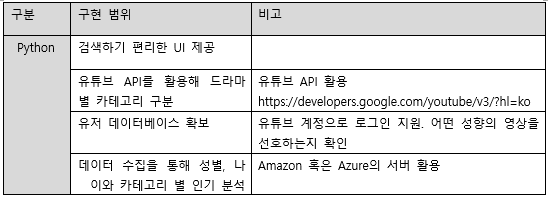
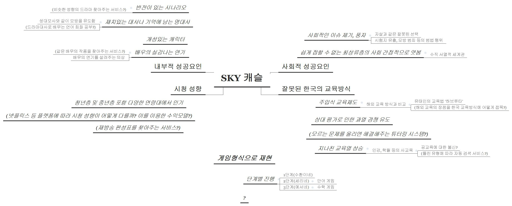

# 프로젝트 계획서
<목차>
1. SW 프로젝트 개요
\
   1.1 프로젝트 개요
\
   1.2 프로젝트 명 및 기간
\
   1.3 프로젝트 범위

2. 프로젝트 목표
\
   2.1 프로젝트 외부 목표
\
   2.2 프로젝트 내부 목표

3. 프로젝트 역할
\
   3.1 프로젝트 팀원 역할
\
   3.2 Work Breakdown Structure

4. 개발 환경
## 1. SW 프로젝트 개요
### 1.1. 프로젝트 개요
  - 개요
     - 스카이 캐슬이 최근 도깨비의 시청률을 뛰어넘고 최고 시청률을 달성했다. 이러한 드라마 붐에 힘입어, 비슷한 카테고리의 드라마를 추천해주는 어플을 제작.
     - 

### 1.2. 프로젝트 명 및 기간
  - 기간 : 2019년 01.18 ~ 2019년 4월 30일
  - 참여 인원
    - 유재덕
    - 이인원
    - 이서영
    - 신연권
### 1.3. 프로젝트 범위
## 2. 프로젝트 목표

  
 2.1. 프로젝트 외부 목표
   - 시청자들에게 보다 편리하게 드라마를 제공
   - 검색 상황을 분석해 어느 분기에 어떤 성향의 드라마가 어떤 시청자들에게 인기 있는지 방송사에 제공
   - 방송사는 보다 소비자 만족도가 높은 드라마를 만들도록, 시청자는 보다 편하게 드라마 검색을 할 수 있도록 유도.

 2.2. 프로젝트 내부 목표
  - API와 서버를 활용해 데이터베이스를 포함한 프로그래밍을 구현
  - 

## 3.  프로젝트 역할

### 3.1. 팀원 별 주요 역할
  신연권 : 
  이인원 : 응원단장
  이서영 :
  유재덕 :

### 3.2. Work Breakdown Structure
  1.18(수) ~ 4.30
  5.1 : 작품 발표회 가정
|프로젝트일정|2019.01.25~1.30||||
|---|---|---|---|---|
|단계|1월|2월|3월|4월|
|프로젝트 계획|
|설계|
|Prototype|
|디자인|
|개발|
|Test|

#### 브레인 스토밍
  

#### 아이디어 구체화

##### 산성비 형식의 게임 제작
 1. 체력 시스템
   - 시간이 지날수록 기본적으로 체력 감소
     - 난이도와 스테이지 플레이 시간에 비례해 감소량 증가
   - 단어 잘못 입력하면 체력 감소
   - 단어 놓치면 체력 감소
  
  
 2. 아이템 시스템
  - 일정 길이 이상의 문장, 혹은 빈칸 문제 맞췄을때 아이템 지금
  - 아이템 종류
     - 체력 회복 아이템
     - 추락 속도 빨라지는 대신 추가 점수 지급하는 아이템
      - 추락 속도 감소 아이템
 3. 시스템 구현
  - 단어들은 linked-list에 위치 데이터와 단어 데이터를 저장해 구현
  - 단어들의 낙하는 모든 단어들의 y좌표를 바꾸고 gotoxy문을 재실행하는 방식으로 구현
  - 체력이 0이 되면 게임 오버, 일정 점수 이상 낼때마다 다음 단계로 넘어감

#### 역할 분담

#### Research 

##### 1. 기술 트렌드
- 파이썬과 같은 프로그래밍 언어들은 왠만한 기능은 전부 구현이 되어있다. 결국 핵심은 이들의 활용하는 방식이며, 그에 따라 제품의 완성도가 결정된다.

##### 2. 관련 기술
- python : 현재 가장 많이 쓰이는 프로그래밍 언어. 개발 취지가 '간단함'인만큼 다른 언어들에 비해 상당히 간단한 편이다.
[https://www.python.org](https://www.python.org)

- linked-list : 특정 data를 보유한 node들을 서로 연결해둔 자료형. 이전 node에 미리 다음 node의 정보를 저정해두고, 이후 다음 node를 참조할때 이를 활용한다.

- pygame : 파이썬에서 사용되는 대표적인 게임 게발 모듈. 간단한 게임을 만들때 자주 쓰인다.
  [pygame 강의](https://www.inflearn.com/course/%ED%8C%8C%EC%9D%B4%EC%8D%AC-%EA%B2%8C%EC%9E%84-%EB%A7%8C%EB%93%A4%EA%B8%B0-python/)
  [https://www.pygame.org](https://www.pygame.org)
  

##### 2. 시장 동향 분석(프로젝트 아이디어와 유사한 제품이 있는지, 있다면 강점이 뭔지)
- 현재 게임 시장은 복합적인 요소로 인해 매우 불안한 상태이다.
    1. 넥슨 매각 사건
      현재 한국이 게임으로 벌어들이는 외화가 6조원 이상으로 콘텐츠 수출 분야 중 1위에 해당한다. 이런 상황에서 넥슨 매각은 한국 게입업계 뿐만 아니라 한국 자체에 상당히 큰 영향을 미칠것으로 예상된다.

    2. 과도한 양산형 게임
      게임 시장을 조금만 둘러봐도 유사한 게임이 상당히 많다. 이는 투자자들이 도박수를 지양하고 어느정도 매출이 보장된 게임을 개발하길 원해서 생긴 문제이다.

    3. 사회적으로 부정적인 시각
      사회에선 게임이라는 분야 자체를 매우 부정적으로 평가하고 있다. 

#### 예산
- 라즈베리 파이 키트
- 모니터 및 케이블
- 키보드

## 4. 개발 환경
  - Software
    - python 3.X
    - pygame

