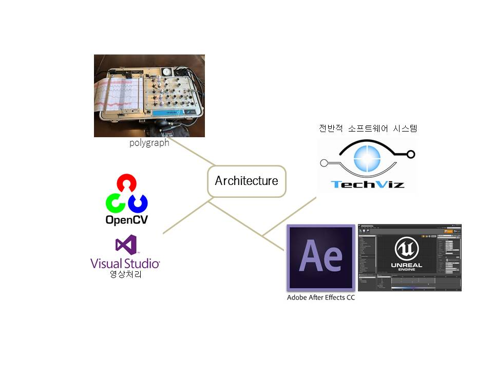
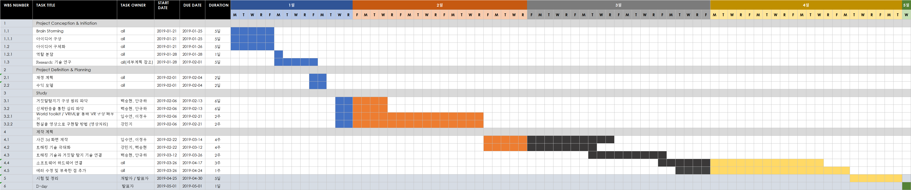

# SW 프로젝트

## 1.1 프로젝트 개요:

    법정 재판에서 범죄 상황을 재현하여 정확한 상황을 보여주고 
    범죄자의 심리를 이와 연결하여 살펴보는 기술을 개발한다.

## 1.2 프로젝트명 및 기간

- 프로젝트명: 셜록 홈즈
- 1조: 강민지, 백승현, 안규하, 이정우, 임수연
- Date: 2019.01.16(Wed)~2019.05.01(Wed)
- location: 건국대학교 신공학관 1203호 외

## 1.3 프로젝트 선정 (마인드맵에서 생각)
    ar과 vr 그리고 넥슨을 주제로 마인드맵을 구상하였습니다. 
        
    1. 가상현실을 이용한 발표 프로그램
    2. 신빙성 있는 기사만 모아두는 사이트
    3. 주식 예측 프로그램
    4. 기업 실적 및 안정성 책정 프로그램
    5. 증강현실을 이용한 소방헬멧
        - 재해 시 행동 방법을 알려주는 증강현실 프로그램
    6. 법정 재판에 vr 적용

## 1.4 프로젝트 범위

| 구분 |    구현범위   | 비고 | 
| ---- | ------------ | ---- |
|소프트웨어|  간단한 사진을 받아 화면을 구축할 수 있는 vr 프로그램 개발 |        |
| 하드웨어 | 시제품 사용-프로그램과의 연결만 중요  |         |
| 심리 | 눈동자의 움직임을 통한 심리측정 데이터베이스 마련|  |

개발 architecture

------------------

# 2. 프로젝트 목표

## 2.1 프로젝트 외부 목표

    성과물 : VR + 심리 분석 기능을 합친 프로그램
    효과 : vr로 범죄 재현을 함으로써 증거를 가시화하고 심리 측정을 통해 법정 재판에 도움을 준다.

## 2.2 프로젝트 내부 목표

    정의 구현
    프로젝트 개발 경험
    vr 기술에 대해 이해하고 다양한 활용 경험 갖기
    프로젝트를 같이 하여 팀 내 내부 결속 강화
    
# 3. 프로젝트 역할

## 3.1 팀원 별 주요 역할

    기획자: 안규하
    개발자: 이정우, 임수연, 백승현
    프로젝트 매니저: 강민지

## 3.2 WBS (Work Breakdown Structure)

----------------------------

### 리서치:
    
    1. Reserch: 기술 트렌드 연구
    - <VR 및 몰입형 가상 환경과 법원 응용 프로그램의 협업> 논문 분석
        사용 현황, 장단점 파악
    2. Research: 기술 연구
    - vr tool 조사 :techviz, after effect, 유니티 등 vr 개발 툴이 활성화되어 있음.
    - vr hardware 조사 : 

---
    3. Research: 시장 동향 분석
    - 스위스 취리히 법의학대학 연구진은 VR 헤드셋인 오큘러스 리프트(Oculus Rift)를 사용해 범죄를 3D 컴퓨터 화면으로 재구성하는 연구에 관한 논문을 작성했다. 
    - 영국 스태포드셔대학의 연구진은 배심원단을 가상의 범죄 현장으로 이동시키는 VR 기술을 실험했다. 
    - '셜록홈즈' 프로젝트 만의 강점: vr 기술을 법정 재판에 적용시키는 것뿐만 아니라 범죄 상황을 재현하는 범죄자의 심리까지 파악하고 출력한다.

-----------------------------
### 전체적 개발 및 구현 계획

-----------------------------
### 재정 계획
- VR 하드웨어 기기 구매