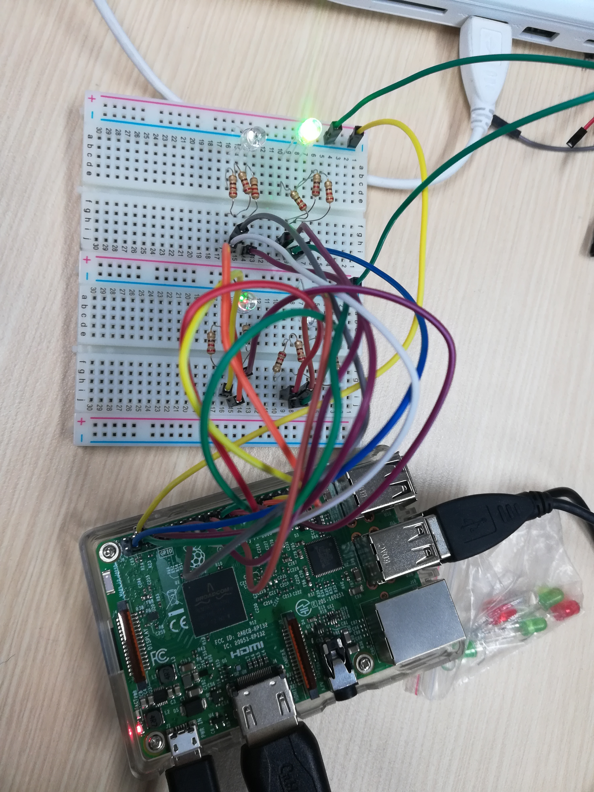

# Review Note

- Date: 2019.01.21(Mon) 15:00~18:00
- location: 건국대학교 신공학관 1203호

## 학습 목표
    실시간으로 날씨 상황을 api로 전달받아 라스베리파이로 날씨에 따라 결과를 led로 출력하기

## 복습

    1. 라즈베리파이
        리눅스를 통해서 bash명령을 사용해보는 연습.
        파이썬 코드를 짜서 LED 키고 끄는 것 했음 - 하드웨어
    2. git
        VSCode와 markdown을 통해서 문서를 정리하고 github에 연동시키는 것을 했음.
    3. python
        문법을 알고 하드웨어와 연동하여 코드를 발현시키는 방법을 배움.
    4. api 연결
        openai에서 JSON 형태로 값을 전달받아서 센서를 사용하지 않고 날씨를 알 수 있게 했음.
        인터넷(openai)과 pc 사이의 거리가 제일 멀다.
        openweathermpa.org에서 그래프 혹은 사진 등으로 데이터를 받지 않고 코드로 받는 이유는
        그것을 분석하는 것이 더 빠르기 때문 - 시간 혹은 용량 다양한 측면에서 텍스트가 제일 빠르다. 

## api 실패 분석

    windows에서 cui기반 인터페이스 - 명령어도 다르다
    windows에서 git은 파이썬이 실행 불가능하다.
    결론 - VSCode에서 터미널을 쓰거나 (ctrl+shift+p) 아니면 ubuntu/ powershell을 사용한다.

## VScode 사용 (자세히)

    파이썬 코드를 작성할 수 있는 에디터 
        - 메모장
        - VScode
        - nano (bash/ubuntu)
    
    왼쪽 아이콘 5개가 중요하다.
    Open Folder - 자신이 작업하는 폴더를 지정해준다. 이 때 폴더를 나눠서 저장해주기.
    사진을 띄울 때 같은 폴더안에 있어야 한다.
    절대경로: 루트 경로인 c부터 쭉 내려가는 것
    상대경로: ../폴더이름/이미지 로 한다. 자신의 위치를 기준으로 지정

    터미널에서 git에서와 같이 그대로 사용하면 된다
    혹은 source control 3번째 아이콘에서 메세지 적고 체크버튼누르고 mater 옆에 새로고침 버튼을 누르면 업데이트가 바로 된다.

## 라즈베리파이를 이용하여 날씨 api를 통해 led로 알림 구현하기
    구상: 날씨 api를 실시간으로 받는다. 
         https://openweathermap.org/
         각각이 200,300,500,600,700,800대로 날씨를 표현하게 되는데
         // 100으로 몫을 각각 2,3,5,6,7,8 인 경우로 나뉘게 되는데 
         조건문으로 각 상황에 led가 어떤게 켜지는 지를 코드로 정하기
         핀번호에 맞게 RGB led를 꽂고 구현한다.

        2XX: thunderstorm,rgb
        3XX: drizzle,gb
        5XX: rain, b
        6XX: snow, rg
        7XX: Atmosphere, g
        800: clear, rb
        8XX: clouds, r

        1번 led: 2(r), 3(g), 4(b)
        2번 led: 17(r), 27(g), 22(b)
        3번 led: 5(r), 6(g), 13(b)
        4번 led: 10(r), 9(g), 11(b)
        


```python
#코드
import requests
import json
import RPi.GPIO as GPIO
import time

GPIO.setmode(GPIO.BCM)
print ("LED for output") 
/* 먼저 다 꺼준다 */
GPIO.setup(2, GPIO.OUT)
GPIO.output(2, False)
GPIO.setup(3, GPIO.OUT)
GPIO.output(3, False)
GPIO.setup(4, GPIO.OUT)
GPIO.output(4, False)
GPIO.setup(17, GPIO.OUT)
GPIO.output(17, False)
GPIO.setup(27, GPIO.OUT)
GPIO.output(27, False)
GPIO.setup(22, GPIO.OUT)
GPIO.output(22, False)
GPIO.setup(5, GPIO.OUT)
GPIO.output(5, False)
GPIO.setup(6, GPIO.OUT)
GPIO.output(6, False)
GPIO.setup(13, GPIO.OUT)
GPIO.output(13, False)
GPIO.setup(10, GPIO.OUT)
GPIO.output(10, False)
GPIO.setup(9, GPIO.OUT)
GPIO.output(9, False)
GPIO.setup(11, GPIO.OUT)
GPIO.output(11, False)

r= requests.get( "http://api.openweathermap.org/data/2.5/weather?q=Seoul,kr&appid=84c84b95b8315afa208b27b48ca91f55")
// api를 실시간으로 받는다
r = json.loads(r.content.decode('utf-8').replace("'",'"'))
print(r['weather'][0]['id'])
wid = r['weather'][0]['id']

/* 날씨정보에 따라서 led 결과 정하기 */

if wid//100 == 8:
    if wid/100 > 8:
        print("Clouds,red")
        GPIO.output(2, True)
        GPIO.output(17, True)
        GPIO.output(5, True)
        GPIO.output(10, True)
    else:
        print("Clear,margenta")
        GPIO.output(2, True)
        GPIO.output(4, True)
        GPIO.output(17, True)
        GPIO.output(22, True)
        GPIO.output(5, True)
        GPIO.output(13, True)
        GPIO.output(10, True)
        GPIO.output(11, True)


elif wid//100 == 7:
    print("Atmosphere,green")
    GPIO.output(3, True)
    GPIO.output(27, True)
    GPIO.output(6, True)
    GPIO.output(9, True)

elif wid//100 == 6:
    print("Snow,yellow")
    GPIO.output(2, True)
    GPIO.output(17, True)
    GPIO.output(5, True)
    GPIO.output(10, True)
    GPIO.output(3, True)
    GPIO.output(27, True)
    GPIO.output(6, True)
    GPIO.output(9, True)    

elif wid//100 == 5:
    print("Rain,blue")
    GPIO.output(4, True)
    GPIO.output(22, True)
    GPIO.output(13, True)
    GPIO.output(11, True)

elif wid//100 == 3:
    print("Clear,cyan")
    GPIO.output(3, True)
    GPIO.output(27, True)
    GPIO.output(6, True)
    GPIO.output(9, True)
    GPIO.output(4, True)
    GPIO.output(22, True)
    GPIO.output(13, True)
    GPIO.output(11, True)    

elif wid//100 == 2:
    print("Thunderstorm,white")
    GPIO.output(2, True)
    GPIO.output(17, True)
    GPIO.output(5, True)
    GPIO.output(10, True) 
    GPIO.output(3, True)
    GPIO.output(27, True)
    GPIO.output(6, True)
    GPIO.output(9, True)
    GPIO.output(4, True)
    GPIO.output(22, True)
    GPIO.output(13, True)
    GPIO.output(11, True)       

else:
    print("Error getting api data")
    for j in range(1,400):
        for i in range(2,4):
            GPIO.output(i, True)
            timesleep(1/10)
            GPIO.output(i, False)
            timesleep(1/10)

timesleep(10) // 10초정도 띄우기
GPIO.cleanup()
```