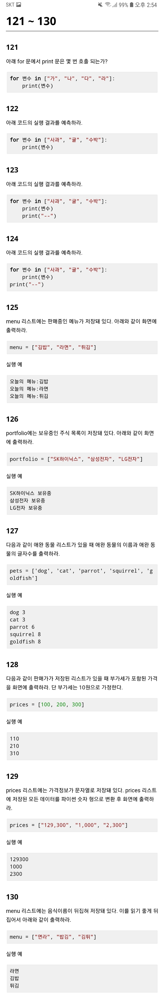
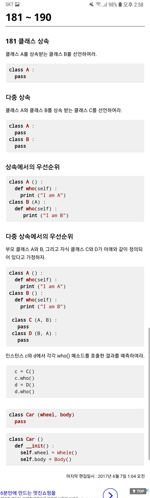

# 파이썬 문제


```python
#1
print("Hello World!")
```

```python
#2
print("Mary's cosmetics")
```

```python
#3
print('신씨가 소리질렀다."도둑이야"')
```

```python
#4
print("C:\\\windows")
```

```python
#5
print("안녕하세요.\n만나서\t\t반갑습니다.") 
//  \n:줄바꿈
//  \t:수평탭 
```

```python
#6
print ("오늘은", "일요일")
// 오늘은 일요일
```

```python
#7
print ("Naver", "Kakao","Sk","Samsung",sep = ";") //sep: 공백을 넣을 수 있다.
``` 

```python
#8
print ("Naver", "Kakao","Sk","Samsung",sep ="\")
```

```python
#9
print ("First", end = " ");print("Second",end = " ");
```

```python
#10
print (len(string)) //len으로 문자열의 길이 파악
``` 


```python
#11
>> a = "3" >> b = "4"
>> print(a + b)
34 
```

```python
#12
print(s + '! '+ t) 
```

```python
#13
>>print("Hi" * 3)
HiHiHi 
```

```python
#14
print("-" * 80) 
```

```python
#15
print((t1 + ' ' + t2 + ' ')*4) 
```

```python
#16
print(20000*10) 
```

```python
#17
>> 2 + 2 * 3
​8 
```

```python
#18
>> a = 128
>> print (type(a))
<class 'int'>

​>> a = "132"
​<class 'str'> // 따옴표로 이뤄져있으면 문자열
```

```python
#19
num = int(num_str) // str 형을 그냥 int로 선언
```

```python
#20
num_str = str(num) // str로 num선언
```


```python
#21
print(lang[0],' ',lang[2]) //배열 안에서 0부터 시작
```

```python
#22
print(license_plate[4],license_plate[5],license_plate[6],​license_plate[7])
```

```python
#23
print(string[::1]) // 0부터 한칸씩 띄어서 print
```

```python
#24
print(string[5::-1]) // 끝에서부터 역순으로 
```

```python
#25
phone_number.replace('-', ' ') // replace 메소드 사용 가능
```

```python
#26
phone_number.replace('-', '')
```

```python
#27
print(url[-2:]) // 끝에 2개
```

```python
#28
TypeError: 'str' object does not support item assignment
```

```python
#29
string.replace('a', 'A') // replace 메소드 사용
```

```python
#30
abcd // replace를 썼을 때 다른 변수에 넣어줘야 함
``` 


```python
#41
movie_rank = ["닥터 스트레인지", "스플릿", "럭키"]
```

```python
#42
movie_rank .append("배트맨") //append 메소드로 배열 맨 뒤 추가
```

```python
#43
movie_rank.insert(1,"슈퍼맨") // insert로 지정 위치에 삽입
```

```python
#44
movie_rank.remove('럭키') // 직접 지우기
```

```python
#45
movie_rank.remove('스플릿')
movie_rank.remove('배트맨')
​del movie_rank[2:] // 뒤에서 지우기
```

```python
#46
langs = lang1 + lang2 // 배열은 배열간의 합으로 표시 가능
```

```python
#47
print("max: ",max(nums))
print("min: ",min(nums)) // 삼다항 사용 필요없이 배열은 min,max로 바로 구할 수 있음
```

```python
#48
print(sum(nums)) // 합은 sum으로 바로 구해짐
```

```python
#49
print(len(cook)) // str과 마찬가지로 배열의 길이 구할 수 있음
```

```python
#50
print((sum(nums))/len(nums))
```


```python
#51
print(price[1:7]) 
```

```python
#52
print(nums[::2]) 
```

```python
#53
print(nums[1::2]) 
```

```python
#54
print(nums[::-1]) 
```

```python
#55
print(interest[0],interest[2])
```

```python
#56
print(' '.join(interest)) // ' '를 공백으로 두고 join으로 나열시킨다
```

```python
#57
print('/'.join(interest))
```

```python
#58
print('\n'.join(interest))
```

```python
#59
interest = []
interest.append(string[0:4])
interest.append(string[5:9])
interest.append(string[10:15]) // 먼저 배열 선언하고 각각의 string부분을 나눠서 배열에 추가
```

```python
#60
interest = string.split('/') // split으로 /로 나눌 수 있다
``` 


```python
#61
interest_0 = ['삼성전자', 'LG전자', 'SK Hynix']
interest_1 = interest_0
interest_1[0] = 'Naver'
print(interest_0) //넣어주는 것과 마찬가지
// ['Naver', 'LG전자', 'SK Hynix']
```

```python
#62
? 
```

```python
#63
my_variable () 
```

```python
#64
tuple 은 변경 불가능 arr // array와 비슷한 개념이지만 바꿀 것이 없을 때 사용
```

```python
#65
my_tuple(1,) // 한개만 있어도 무조건 , 넣기
```

```python
#66
int
```

```python
#67
t = (t[0].upper(), t[1], t[2]) // 새로 지정을 해주거나 아니면 upper로 대문자로 바꿔주기
```

```python
#68
data = list(interest) // 튜플은 바로 list 선언가능
```

```python
#69
data = tuple(interest) // 리스트도 튜플로 바꿀 수 있음
```

```python
#70
my_tuple = (1, 2, 3)
a, b, c = my_tuple
print(a + b + c) // 각각의 값이 대입되었다.
```


```python
#71
/*데이터 패킹과 언패킹: 
    여러 개의 수르르 튜플을 담고 그 튜플을 변수에 대입하면 변수 하나가 여러 개의 데이터를 가질수 있음
    여러 개의 데이터를 컬렉션으로 묶어 변수에 대입하는 것을 패킹(packing)이라고 부른다.
    언패킹할 때, 즉 시퀀스의 요소를 변수 시퀀스에 나눠 대입할 때는 두 시퀀스의 길이가 일치해야 한다.*/

*valid_score, a, b = scores
```

```python
#72
_, _, *valid_score = scores
```

```python
#73
_, *valid_score, _ = scores
```

```python
#74
temp = {}
```

```python
#75
icecream_price = {'메로나':1000, '폴라포':1200, '빵빠레':1800}
```

```python
#76
icecream_price['죠스바'] = 1200
icecream_price['월드콘'] = 1500
// 딕셔너리 추가는 각각 해준다.
```

```python
#77
print("메로나 가격:", icecream_price['메로나']) // 딕셔너리는 dict이름과 원하는 요소를[] 안에 넣어서 프린트
```

```python
#78
icecream_price['메로나'] = 1300 // 넣어주는 것과 똑같이
```

```python
#79
del icecream['Melona']
```

```python
#80
>> icecream = {'폴라포': 1200, '빵빠레': 1800, '월드콘': 1500, '메로나': 1000}
>> icecream['누가바']
Traceback (most recent call last):
  File "<pyshell#69>", line 1, in <module>
    icecream['누가바']
KeyError: '누가바'
딕셔너리에 누가바가 없다. 에러를 없애기 위해서는 코드에서 묻는 것을 바꾸거나 누가바를 딕셔너리에 추가한다.
```


```python
#81
inventory ={'메로나':[300, 20], '비비빅':[400, 3], '죠스바':[250, 100]}
```

```python
#82
print("메로나 가격:", inventory['메로나'][0],"원")
```

```python
#83
print("메로나 재고:", inventory['메로나'][1],"개")
```

```python
#84
inventory['월드콘'] = [500, 7]
```

```python
#85
list(icecream.keys())
```

```python
#86
list(icecream.values())
```

```python
#87
print(sum(icecream.values()))
```

```python
#88
icecream['팥빙수'] = 2700
icecream['아맛나'] = 1000
```

```python
#89
keys = (apple, pear, peach)
vals = (300, 250, 400)
result = dict(zip(keys, vals))
>> print(result)
{'apple': 300, 'pear': 250, 'peach': 400}
```

```python
#90
close_table = dict(zip(date, close_price))
```


```python
#91
Boolean 데이터 타입 //불리언(boolean) 자료형은 논리 자료형이라고도 하며, 참과 거짓을 나타내는 데 쓰인다. 주로 참은 1, 거짓은 0에 대응
```

```python
#92
False
```

```python
#93
True
```

```python
#94
True
```

```python
#95
True
```

```python
#96
비교연산자로 쓰기 위해서는 3 >= 4 라고 해야한다.
```

```python
#97

```

```python
#98
"Hi, there."
```

```python
#99
1
2
4
```

```python
#100
3
5
```


```python
#101
user_in = input()
print(user_in,user_in)
```

```python
#102
user_data = int(input("숫자를 입력하세요:"))
print(user_data + 10)
```

```python
#103
user_in = int(input())
if user_in % 2 == 0 :
    print("짝수")
else :
    print("홀수")
```

```python
#104
pixel = int(input("입력값:")) 
if pixel+ 20 > 255 :
    pixel = 255
else :
    pixel = pixel + 20
print ("출력값:", pixel)
```

```python
#105
pixel = int(input("입력값:")) 
if pixel - 20 > 0:
    pixel = pixel - 20
else :
    pixel = 0
print ("출력값:", pixel)
```

```python
#106
user_in = input("현재시간:")
if user_in[1:] == "00" :
    print("정각 입니다")
elif user_in[2:] == "00" :
    print("정각 입니다")
elif user_in[2:] == "00" :
    print("정각 입니다")
elif user_in[4:] == "00" :
    print("정각 입니다")
elif user_in[5:] == "00" :
    print("정각 입니다")
elif user_in[6:] == "00" :
    print("정각 입니다")
elif user_in[7:] == "00" :
    print("정각 입니다")
elif user_in[8:] == "00" :
    print("정각 입니다")
elif user_in[9:] == "00" :
    print("정각 입니다")
elif user_in[10:] == "00" :
    print("정각 입니다")
elif user_in[11:] == "00" :
    print("정각 입니다")
elif user_in[12:] == "00" :
    print("정각 입니다")
else :
    print("정각이 아닙니다")
```

```python
#107
fruit = ["사과", "포도", "홍시"]
user_in = input("좋아하는과일은?")
if user_in in fruit:
    print("정답입니다")
else :
    print("오답입니다") 
// 답변이 in 리스트 로 표시
```

```python
#108
warn_investment_list = ["Microsoft", "Google", "Naver", "Kakao", "SAMSUNG", "LG"]
user_stock = input("종목 입력:")
if user_stock in warn_investment_list :
    print ("투자 경고 종목입니다.")
else :
    print ("투자 경고 종목이 아닙니다.")
```

```python
#109
user_in = input("제가좋아하는계절은:")
if user_in in fruit.keys() :
    print("정답입니다")
else :
    print("오답입니다")
// 계절은 key 값에 있으므로 key    
```

```python
#110
user_in = input("좋아하는과일은?")
if user_in in fruit.values():
    print("정답입니다")
else :
    print("오답입니다")
```


```python
#111
user_in = input()
if user_in.islower():
    user_in = user_in.upper()
else :
    user_in = user_in.lower()
print(user_in)
```

```python
#112
score = int(input("score:"))
if score > 80 :
    print("grade is A")
elif score > 60 :
    print("grade is B")
elif score > 40 :
    print("grade is C")
elif score > 20 :
    print("grade is D")
else :
    print("grade is E")
```

```python
#113
user_in = input("입력:").split() //.split?

amount = user_in[0]
currency = user_in[1]

if currency == "달러" :
    ratio = 1167
elif currency == "엔" :
    ratio = 1.096
elif currency == "유로" :
    ratio = 1268
else :
    ratio = 171
print(ratio * int(amount), "원")
```

```python
#114
num1 = int(input("input number1:"))
num2 = int(input("input number2:"))
num3 = int(input("input number3:"))
max_num = max(num1, num2, num3)
print(max_num)

```

```python
#115
phone_number = input ("휴대전화 번호 입력 : ")
if phone_number[0:3] == "011" :
    print ("당신은 SKT 사용자입니다.")
elif phone_number[0:3] == "016" :
    print ("당신은 KT 사용자입니다.")
elif phone_number[0:3] == "019" :
    print ("당신은 LGT 사용자입니다.")
else :
    print("당신은 알수없는 사용자입니다.")
```

```python
#116
?
```

```python
#117
reg_num = input("주민등록번호:")
if reg_num[7] in ['2', '4'] :
    print ("여자")
else : 
    print ("남자")
```

```python
#118
reg_num = input("주민등록번호:")
if int(reg_num[8:9]) <= 8 :
    print ("서울 입니다.")
else : 
    print ("서울이 아닙니다.")
```

```python
#119
reg_num = input("주민등록번호:")
sum = int(reg_num[0])*2 + int(reg_num[1])*3 + int(reg_num[2])*4 + int(reg_num[3])*5 + int(reg_num[4])*6+ int(reg_num[5])*7 + 
      int(reg_num[7])*8 + int(reg_num[8])*9 + int(reg_num[9])*2 + int(reg_num[10])*3 + int(reg_num[11])*4+ int(reg_num[12])*5

rem = sum % 11

valid_num = 11 - rem

if int(reg_num[13]) == valid_num :
    print("유효한 주민등록번호입니다.")
else :
    print("유효하지 않은 주민등록번호입니다.")  
```

```python
#120
volatility = int(btc['max_price']) - int(btc['min_price'])
if int(btc['opening_price']) + volatility > int(btc['max_price']) :
    print("상승장")
else :
    print("하락장")
```



```python
#121
#4번
```

```python
#122
#사과
#귤
#수박
```

```python
#123
#사과
#--
#귤
#--
#수박
#--
```

```python
#124
#사과
#귤
#수박
#---
```

```python
#125
print("오늘의 메뉴는" + menu[1])
print("오늘의 메뉴는" + menu[2])
print("오늘의 메뉴는" + menu[3])

#혹은
for food in menu:
    print("오늘의 메뉴는" + food)
```

```python
#126
for port in portfolio:
    print(port + "보유중")
```

```python
#127
for pet in pets:
    print(pet, len(pet))
```

```python
#128
for price in prices:
    print(pricce+10)
```

```python
#129
for price in prices:
    change = price.replace(',','')
    print(int(change))
```

```python
#130
print food in menu:
    print(food[::-1])
```


```python
#131
for val in my_list[1:]:
    print(val)
```

```python
#132
for val in my_list[::2]:
    print(val)
```

```python
#133
for val in my_list[1::2]:
    print(val)
```

```python
#134
for val in my_list[::-1]:
    print(val)
```

```python
#135
for val in my_list:
    if val < 0 :
        print(val)
```

```python
#136
for val in my_list:
    if val%3 == 0 :
        print(val)
```

```python
#137
for val in my_list:
    if len(val) >= 3:
        print(val)
```

```python
#138
for val in my_list:
    if val >=5 and val <= 10:
        print(val)
```

```python
#139
for val in my_list:
    if val >= 10 and val <= 20:
        if val % 3 == 0:
            print(val)
```

```python
#140
for val in my_list:
    if val%3 == 0 or val%4 == 0:
        print(val)
```


```python
#141
for val in my_list:
    if val.isupper():
        print(val)
```

```python
#142
for val in my_list:
    if val.islower():
        print(val)
```

```python
#143
for val in my_list:
    if val.isupper():
        print(val.lower(),end='')
    if val.islower():
        print(val.upper(),end='')
```

```python
#144
for val in file_list:
    prnt(val.split()[0])
```

```python
#145
for file in filenames:
    if file.endswitch("h"):
        print(file)
```

```python
#146
for file in filenames:
    extension = file.split(',')[1]
    if extension == "h" or extension == "c":
        print(file)
```

```python
#147
new_list=[]
for file in my_list:
    if file > 0:
        new_list.append(file)
```

```python
#148
upper_list = []
for val in my_list:
    if val.isupper():
        upper_list.appent(val)
```

```python
#149
sole_list = []
for val in my_list:
    if vall not in sole_list:
    sole_list(val)
```

```python
#150
sum = 0
for val in my_list:
    sum += val
print(sum)
```


```python
#161
클래스 : 틀
인스턴스 : 붕어빵
```

```python
#162
class Human :
    pass
```

```python
#163
areum = Human()
```

```python
#164
class Human:
    def _init_ (self):
        print("응애응애")
```

```python
#165
class Human:
    def _init_ (self, name, age, gender):
        self.name = name
        self. age = age
        self. gender = gender
```

```python
#166
print("이름:%s, 나이 : %d, 성별 : %s", %(areum.name, areum.age, areum.sex))
```

```python
#167
class Human:    
    def _init_ (self, name, age, sex):
        self.name = name
        self.age = age
        self. sex = sex
    def who(self):
        print("이름:%s, 나이 : %d, 성별 : %s", %(areum.name, areum.age, areum.sex))
```

```python
#168
    class Human:
        def sest_info (self, name, age, sex):
        self.name = name
        self.age = age
        self. sex = sex            
```

```python
#169
class Human:
    def _del_(self):
        print("나의 죽음을 알리지 말아라")
```

```python
#170
self를 입력하지 않음
```


```python
#171
def add(self, other):
    return myInt(self,getNum()+ other.getNum())
def sub(self, other):
    return myInt(self,getNum()- other.getNum())
def mul(self, other):
    return myInt(self,getNum()* other.getNum())
def div(self, other):
    return myInt(self,getNum()/ other.getNum())
```
```python
#172 
def _str_(self):
    return "%d" %(self.num)
```




```python
#231
def print_coin():
    print("비트코인")
```

```python
#232
print_coin()
```

```python
#233 
for i in range(100):
    print_coin()
```

```python
#234
def print_coins () :
    for i in range(100) :
        print ("비트코인")
```

```python
#235
# 함수를 사용 (호출)해서 함수 이름을 찾을 수 없다는 에러가 발생한다.
```

```python
#236
A
B
C
A
b
```

```python
#237
A
C
B
```

```python
#238
A
C
B
E
D
```

```python
#2389
B
A
```

```python
#240
B
C
B
C
B
C
A
```